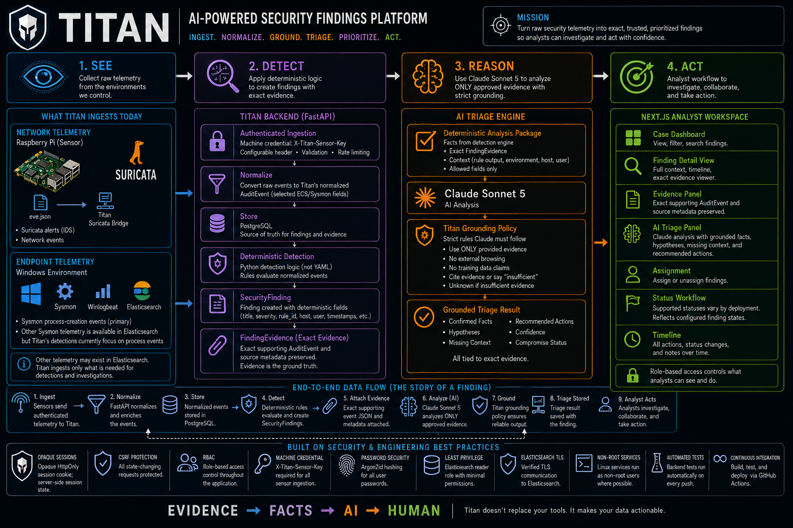
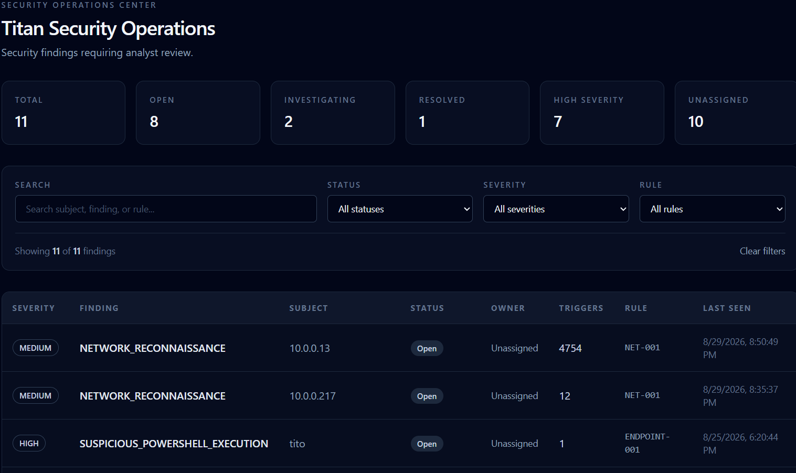
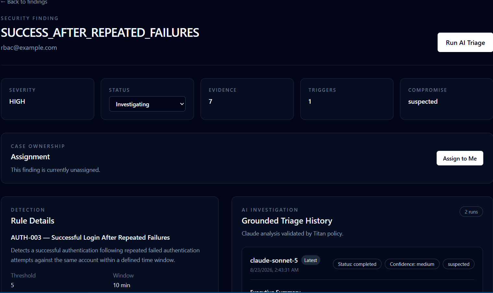
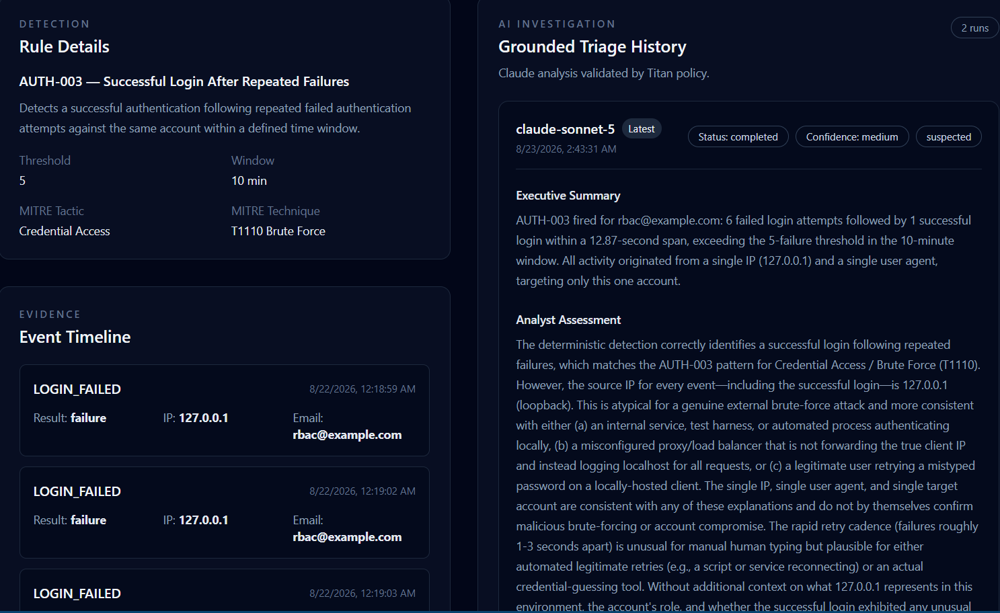

# Titan

> **Evidence-driven, AI-assisted security operations and investigation platform**

Titan is an independent cybersecurity engineering project built to explore how modern security operations work end-to-end: from telemetry collection and deterministic detection to evidence preservation, AI-assisted triage, analyst workflow, and infrastructure hardening.

> **Scope:** Titan is a portfolio and engineering project, not a production enterprise SIEM or a replacement for Splunk or Elasticsearch.

---

## Architecture



Titan follows an evidence-first security workflow:

**SEE → DETECT → REASON → ACT**

Network and endpoint telemetry is normalized into security events, evaluated by deterministic detection logic, preserved as exact evidence, analyzed with Claude Sonnet 5 under Titan's grounding policy, and presented to an analyst for investigation and action.

> **Evidence → Facts → AI → Human**

---

## What Titan Does

Titan combines live **network** and **endpoint** telemetry with deterministic detections, evidence-backed security findings, grounded AI analysis, and a browser-based analyst workflow.

## Screenshots

### Security Findings



### Finding Investigation



### AI-Assisted Triage



---

### Data Flow

```text
Suricata / Sysmon
        ↓
Winlogbeat / Elasticsearch
        ↓
Titan Sensor Bridges
        ↓
Authenticated FastAPI Ingestion
        ↓
Normalized Security Events
        ↓
Deterministic Detection
        ↓
Security Finding + Exact Evidence
        ↓
Deterministic Triage + Claude
        ↓
Titan Grounding Policy
        ↓
Analyst Case View
```

---

## Architecture

### Telemetry

**Network**
- Raspberry Pi sensor
- Suricata
- `eve.json`
- authenticated Titan sensor bridge

**Endpoint**
- Windows Sysmon
- Windows Event Logs
- Winlogbeat
- Elasticsearch
- persistent `search_after` checkpointing

### Control and Investigation Plane

Titan provides:

- authenticated sensor ingestion
- event normalization
- deterministic detection
- evidence preservation
- security findings
- AI-assisted triage
- grounding controls
- analyst assignment
- notes
- status changes
- investigation history

---

## Detection Engineering

| Rule | Detection | MITRE ATT&CK |
|---|---|---|
| `AUTH-001` | Repeated authentication failures | T1110 |
| `AUTH-002` | Password spraying across multiple accounts | T1110.003 |
| `AUTH-003` | Successful login following repeated failures | T1110 |
| `NET-001` | Network reconnaissance / scanning | T1046 |
| `ENDPOINT-001` | Suspicious PowerShell execution | T1059.001 |

Titan does **not** ask the AI model to decide whether an incident exists.

Deterministic rules create a `SecurityFinding`, and the exact triggering events are preserved as evidence.

---

## Evidence-Driven Investigation

A core Titan principle is:

> **AI can interpret evidence, but it cannot replace evidence.**

```text
Raw telemetry
    ↓
Normalized event
    ↓
Deterministic detection
    ↓
Security finding
    ↓
Exact evidence
    ↓
AI-assisted interpretation
```

This makes investigations explainable and auditable.

---

## AI-Assisted Triage

Titan integrates **Anthropic Claude** for structured investigation assistance.

The model receives a controlled payload containing approved evidence and deterministic facts, then returns structured analysis including:

- executive summary
- analyst assessment
- confirmed facts
- hypotheses
- missing context
- recommended actions
- confidence
- compromise status

Titan then applies its own grounding policy before presenting the result to the analyst.

### Grounding Policy

Titan treats AI output as lower-authority than evidence.

```text
Exact Evidence
    ↓
Deterministic Titan Facts
    ↓
Titan Grounding Policy
    ↓
AI Conclusions
    ↓
Human Analyst Judgment
```

For example, reconnaissance may prove that scanning occurred, but it does **not** prove that the target was compromised.

Titan can therefore correct or constrain AI conclusions when the evidence does not support them.

---

## AI Reliability

AI triage runs have explicit lifecycle states:

```text
running → completed
       ↘ failed
```

Titan includes:

- explicit request timeouts
- controlled retry behavior
- temporary vs permanent provider error handling
- persistent failed-run records
- duplicate-running-run prevention
- null-safe API serialization
- safe frontend rendering of failed investigations

A provider failure does not erase the investigation or break the analyst case page.

---

## Analyst Workflow

The Titan case interface supports:

- detection details
- supporting evidence
- AI-assisted triage
- AI investigation history
- grounding corrections
- analyst assignment
- case status changes
- analyst notes
- case activity history

AI assists the analyst; it does not autonomously close incidents.

---

## Security Controls

### Authentication

- Argon2id password hashing
- opaque server-side sessions
- session expiration
- server-side session revocation
- inactive-user enforcement

### Authorization

- role-based access control
- analyst/admin protected security routes

### CSRF Protection

State-changing browser requests require a session-bound CSRF token.

Protected operations include:

- case updates
- analyst notes
- assignments
- AI triage
- logout

### Sensor Authentication

Machine-to-machine ingestion uses a dedicated sensor credential instead of browser session authentication.

---

## Infrastructure Hardening

The Raspberry Pi sensor environment was hardened beyond the original lab configuration.

### Least-Privilege Elasticsearch Access

The Sysmon bridge uses a dedicated read-only Elasticsearch identity instead of the `elastic` superuser.

The bridge can read the Winlogbeat data it requires but cannot perform Elasticsearch administrative operations.

### Verified TLS

The Sysmon bridge validates Elasticsearch using its HTTP CA certificate instead of disabling certificate verification.

### Non-Root Services

Titan sensor bridges run under a dedicated Linux service account:

```text
titan-sensor
```

Service files follow conventional Linux paths:

```text
/opt/titan-sensor       application code
/etc/titan-sensor.env   protected configuration
/var/lib/titan-sensor   persistent state/checkpoints
```

### Restricted Suricata Telemetry

Suricata's `eve.json` telemetry is no longer world-readable.

A dedicated reader group grants Titan only the access required to consume the log.

---

## Testing

### 63 Backend Tests Passing

Test coverage includes:

- authentication
- session management
- session expiration and revocation
- CSRF protection
- logout security
- sensor authentication
- authentication detections
- network detections
- endpoint detections
- deterministic triage
- AI grounding
- AI provider failures
- AI investigation lifecycle
- duplicate AI-run prevention
- failed AI-run serialization
- test-environment isolation

Tests use dummy credentials and isolated configuration rather than loading development secrets.

The test environment uses an in-memory SQLite database.

---

## Continuous Integration

GitHub Actions automatically runs the backend test suite on every push.

```text
Push
  ↓
GitHub Actions
  ↓
Install Python dependencies
  ↓
Run pytest
  ↓
63 passing tests
```

**Current CI status: passing**

---

## Frontend

Titan's analyst interface is built with:

- Next.js
- React
- TypeScript
- App Router
- Tailwind CSS

The frontend has also been validated with a successful optimized production build.

---

## Tech Stack

| Layer | Technology |
|---|---|
| Backend | Python 3.13, FastAPI, Pydantic |
| Database | PostgreSQL, SQLAlchemy, Alembic |
| Network Security | Suricata |
| Endpoint Security | Sysmon, Windows Event Logs |
| Telemetry Pipeline | Winlogbeat, Elasticsearch |
| AI | Anthropic Claude |
| Frontend | Next.js, React, TypeScript, Tailwind CSS |
| Infrastructure | Raspberry Pi, Linux, systemd, Windows |
| CI | GitHub Actions |

---

## Repository Structure

```text
Titan/
├── backend/
│   ├── app/
│   │   ├── core/
│   │   └── domains/
│   │       ├── identity/
│   │       └── security/
│   ├── alembic/
│   └── tests/
│
├── frontend/
│   └── src/
│       └── app/
│           └── security/
│
└── .github/
    └── workflows/
```

---

## Known Limitations

Titan is intentionally a **lab-scale engineering project** rather than a production enterprise SOC.

Current limitations include:

- limited telemetry sources
- limited detection catalog
- single-node development architecture
- no distributed rate-limit store
- no high-availability deployment
- no enterprise secrets-management platform
- no large-scale event-processing pipeline

These are documented engineering boundaries, not claims of enterprise production readiness.

---

## Future Direction

Titan Security Operations is part of a broader effort to explore **privacy-first organizational intelligence**.

The long-term direction is to transform approved organizational information into explainable, evidence-backed decision support while preserving strong security, provenance, and human oversight.

The SOC work provides a technical foundation for protecting that future platform.

---

## What I Learned

Building Titan connected security concepts that are often learned separately:

- telemetry collection
- event normalization
- detection engineering
- evidence preservation
- API security
- authentication
- session management
- RBAC
- CSRF protection
- AI grounding
- analyst workflows
- failure handling
- Linux service hardening
- TLS verification
- least privilege
- automated testing
- continuous integration

The biggest lesson was:

> **A security platform is not simply a collection of alerts. It is a chain of trust from telemetry → evidence → detection → investigation → reasoning → human decision.**

